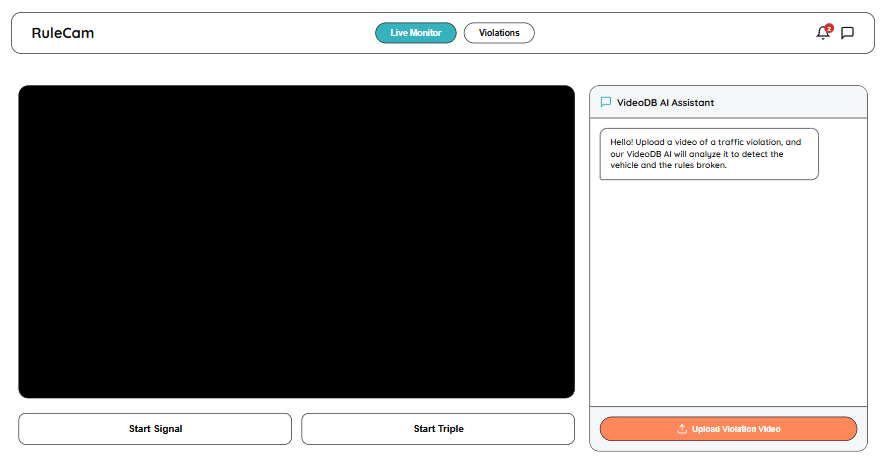
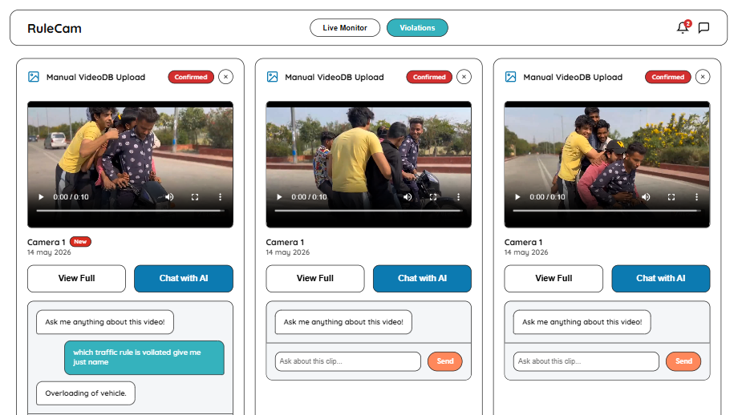
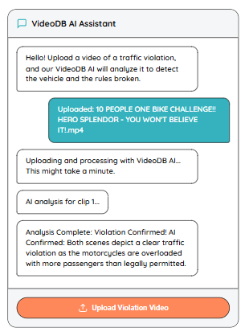

# RuleCam 🚦

RuleCam is a state-of-the-art automated traffic violation detection system. It leverages **YOLOv8** for real-time computer vision and **VideoDB** for sophisticated AI-driven confirmation and analysis.

---

## 📸 Overview

<div align="center">
  <h3>1. Real-Time Monitor</h3>
  
  <p><i>Real-time vehicle detection and violation tracking using YOLOv8.</i></p>

  <br/>

  <h3>2. Violation History & Analytics</h3>
  
  <p><i>Comprehensive history of detected violations with AI-generated evidence.</i></p>

  <br/>

  <h3>3. AI-Powered Confirmation</h3>
  
  <p><i>VideoDB integration providing high-accuracy confirmation and reasoning.</i></p>
</div>

---

## 🚀 Key Features

- **End-to-End Automation**: From real-time detection to AI-confirmed reports.
- **YOLOv8 Integration**: High-speed, high-accuracy object detection for vehicles and traffic lights.
- **VideoDB AI Arbiter**: Uses advanced LLMs to analyze video scenes and confirm violations with human-like reasoning.
- **Interactive AI Chat**: Chat directly with any violation video to ask specific questions about the event.
- **Neo-Brutalist UI**: A clean, modern, and highly responsive dashboard.

---

## 🛠️ Tech Stack

- **Frontend**: React, Vite, CSS3 (Vanilla)
- **Backend**: Python, Flask, OpenCV, SQLite
- **AI/ML**: Ultralytics YOLOv8, VideoDB API

---

## ⚙️ Getting Started

### 1. Environment Configuration

Create a `.env` file in the **backend** directory:
```env
VIDEODB_API_KEY=your_videodb_api_key
PORT=5005
```

Create a `.env` file in the **root** directory:
```env
VITE_BACKEND_URL=http://localhost:5005
```

### 2. Backend Installation

```bash
cd backend
pip install -r requirements.txt
python app.py
```

### 3. Frontend Installation

```bash
npm install
npm run dev
```

---

## 🛡️ License

RuleCam is developed for advanced traffic monitoring and safety enforcement.
